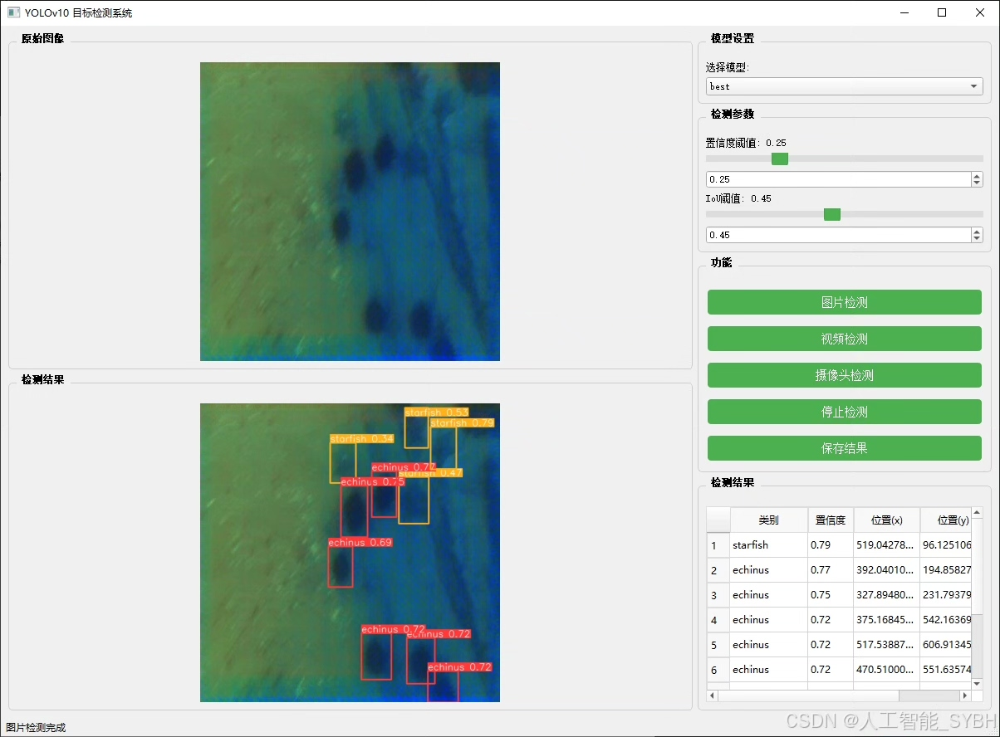
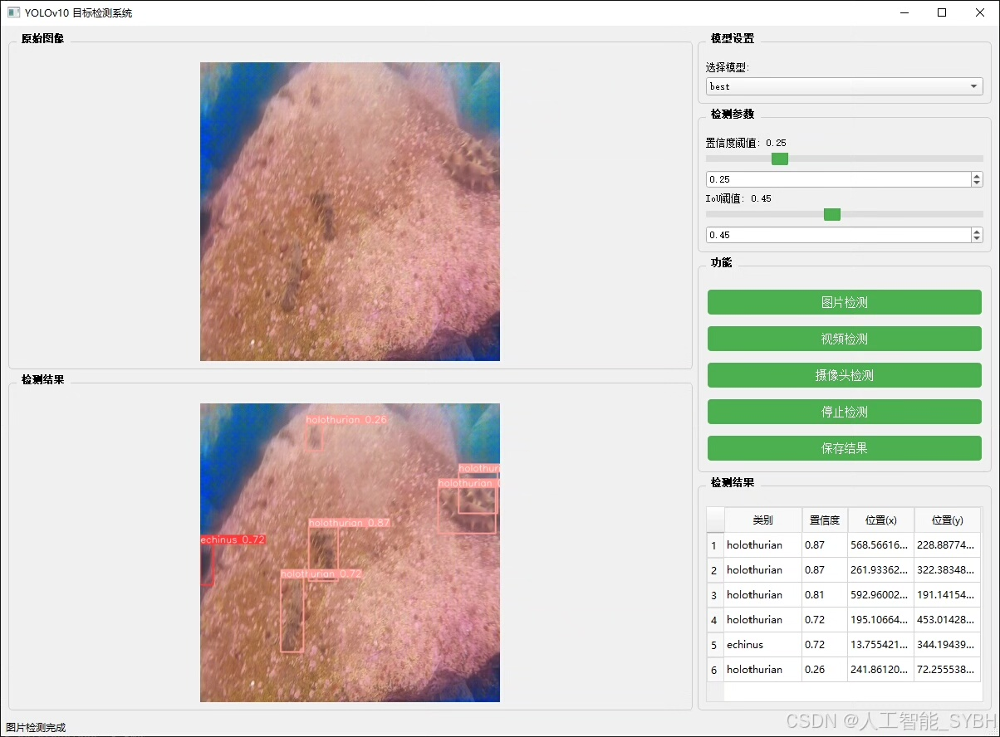
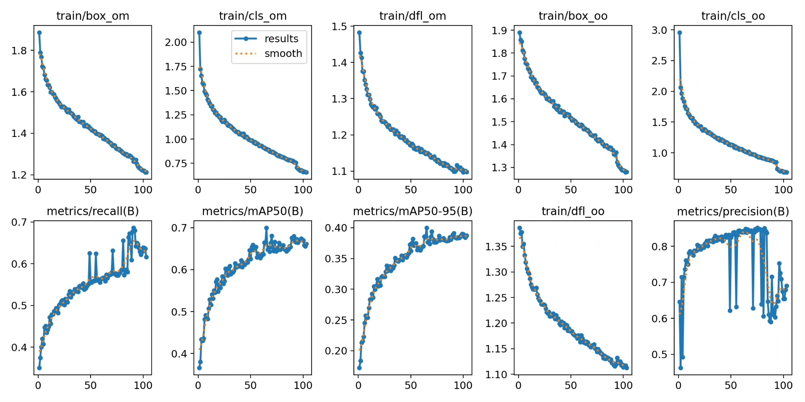
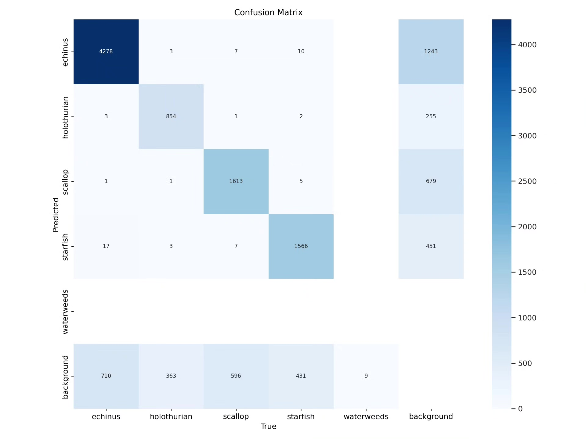
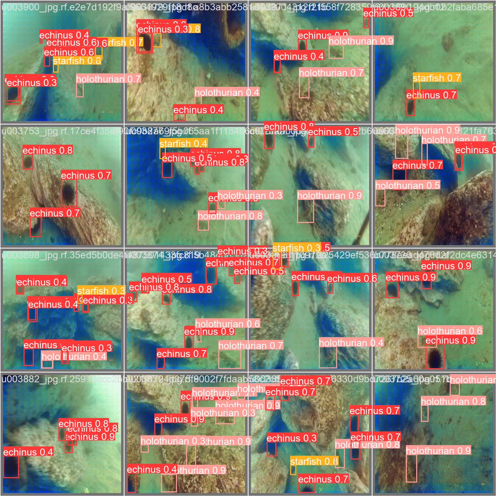
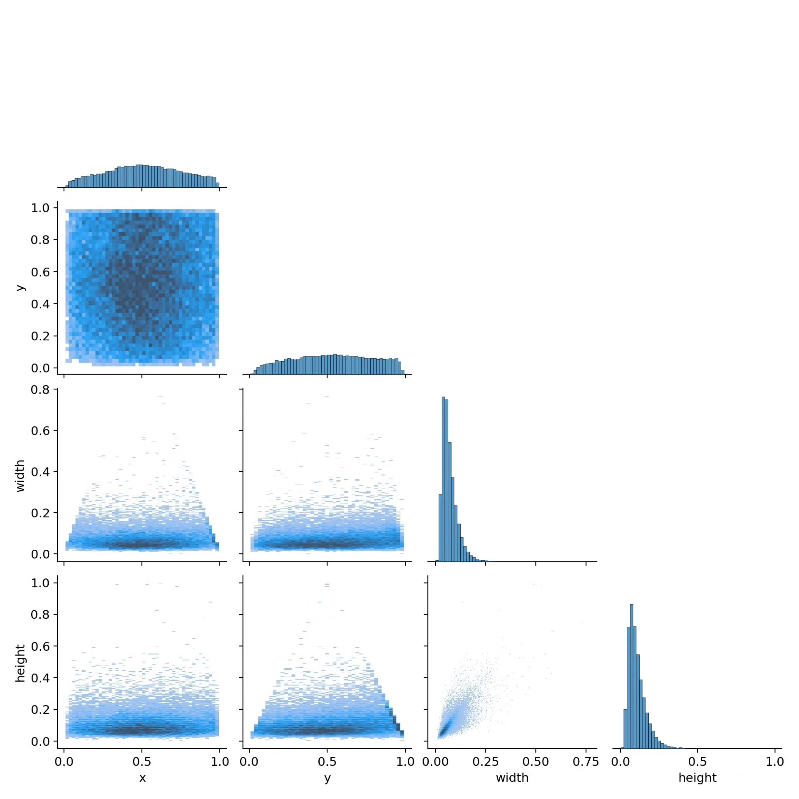

# Underwater biometric identification detection system based on deep learning YOLOv10

## Body

Based on the YOLOv10 object detection algorithm, this project has developed a smart detection system specifically for underwater bio recognition. It aims to achieve automatic recognition and localization of five common underwater organisms (sea urchins, sea cucumbers, scallops, starfishes, and water plants). The system adopts an improved YOLOv10 model architecture and optimizes it for the unique characteristics of underwater environments, achieving excellent detection performance on our self-built dataset. This dataset contains 7600 high-quality labeled images, including 5320 training sets, 1520 validation sets, and 760 test sets, covering various underwater scenes and lighting conditions. The development of this project provides reliable technical support for marine ecological research, aquaculture monitoring, and underwater robotic vision navigation.

The company's products have obtained YOLO official commercial license certification.

We provide after-sales service.

After payment, we will provide WeChat IDs for instant questions.

Environmental configuration: We will provide a tutorial on environmental configuration, with WeChat providing answers.

Remote installation services: If you need remote configuration, an additional fee of 69 is required.
If the configuration fails, all fees will be refunded (only the installation fee is refundable for older computers).

Retraining the dataset: After configuring the environment, you can train on your own computer.
If you need us to retrain, just pay 69 plus the computing power fee (2.5 yuan/hour)

## Images

## Payment

Here is a pay link on Stripe ( https://buy.stripe.com/3cs8yP7sY87d0vu9AB ). Please contact me lonlonago@foxmail.com after funding $89, and I will send you a complete data files , thank you!

